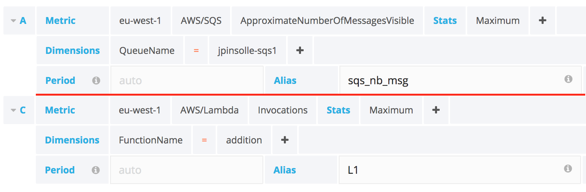
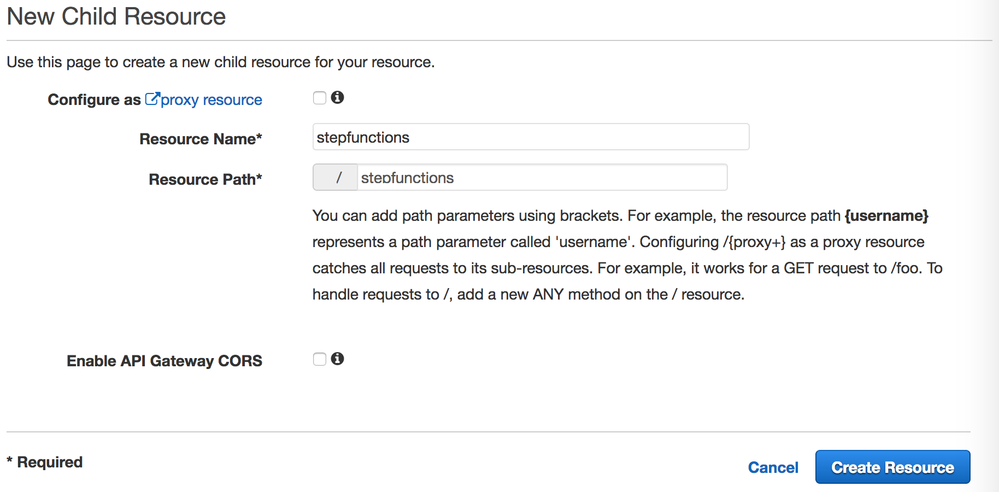
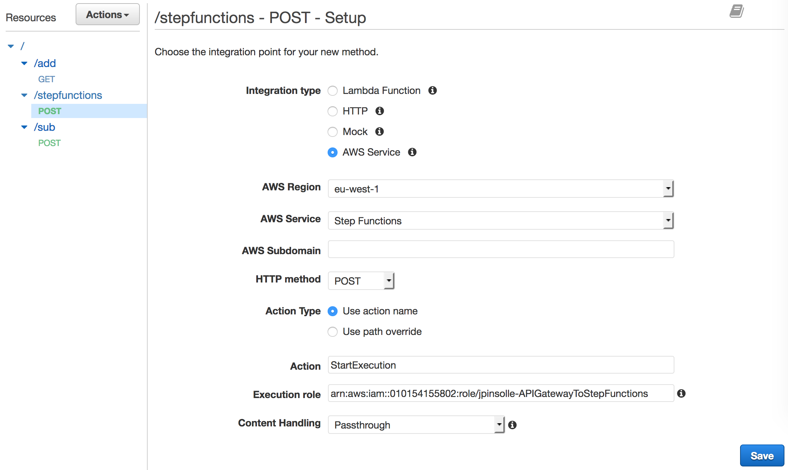

## Démonstration Lambda


### Création lambda (slide 4)
````bash
# Création
zip -j addition.zip addition/*
aws lambda create-function 
  --function-name addition 
  --region eu-west-1 
  --zip-file fileb://addition.zip 
  --role $ROLE_LAMBDA 
  --handler index.add 
  --runtime nodejs4.3
  

# Invocation
aws lambda invoke --function-name addition --payload '{"n1": 4, "n2": 1}' result.txt && cat result.txt

# Suppression (si besoin)
aws lambda delete-function --function-name addition
````


### Versions & Alias (slide 9)

**Alias DEV sur la version $LATEST**
````bash
aws lambda create-alias --function-name addition --name DEV --function-version \$LATEST
````

**Publish version & alias PROD**
````bash
aws lambda publish-version --function-name addition
aws lambda create-alias --function-name addition --name PROD --function-version 3
````

**Modification code & déploiement**
index.js
````javascript
const r = n1 + "" + n2;
````

````bash
zip -j addition.zip addition/*
aws lambda update-function-code --function-name addition --publish --zip-file fileb://addition.zip
````


**Invocation ALIAS**
````
aws lambda invoke --function-name addition:DEV --payload '{"n1": 4, "n2": 1}' result.txt && cat result.txt
aws lambda invoke --function-name addition:PROD --payload '{"n1": 4, "n2": 1}' result.txt && cat result.txt
````

### Serverless (slide 22)
Créer le fichier **serverless.yml** dans le répertoire addition

````yaml
service: OperationService

provider:
  name: aws
  profile: xebia-dev
  region: eu-west-1
  deploymentBucket: jpinsolle-xebia
  runtime: nodejs4.3
  versionFunctions: false

functions:
  addition:
    handler: index.add
    memorySize: 128
    timeout: 10
````

Ajouter une nouvelle lambda

````yaml
functions:
  addition:
    handler: index.add

  substraction:
    handler: index.sub
````

### API Gateway (slide 29)

Exposer la fonction "add" en GET

**serverless.yml**
````yml
functions:
  addition:
    handler: index.add
    events:
     - http:
        path: add
        method: GET
        integration: lambda
        request:
          template:
            application/json: '{ "n1" : $input.params(''n1''), "n2" : $input.params(''n2'') }'
````

**Test**
````bash
curl "API_GATEWAY_URL/dev/add?n1=10&n2=2"
````


Exposer la fonction "sub" en POST

**serverless.yml**
````yaml
substraction:
    handler: index.sub
    events:
     - http:
        path: sub
        method: POST
        integration: lambda
        request:
          template:
            application/json: '{ "n1" : $input.path(''$.n1''), "n2" : $input.path(''$.n2'') }'
````


**Test**
````bash
curl -X POST -H "Content-Type: application/json" -d '{"n1": 10, "n2": 1}' API_GATEWAY_URL/dev/sub
````

### Grafana (slide 34)

````
graph LR
  L1{Lambda1}-->sqs_nb_msg((SQS))
  L1-->s3_nb_obj(S3)
  sqs_nb_msg-->lambda2{Lambda2}
````




## Démonstration Step Functions

### HelloWorld
Création via la console. Appel de la lambda addition déjà définie
**State Machine**
````
{
  "Comment": "HelloWorld state machine for the XKE",
  "StartAt": "Addition",
  "States": {
    "Addition": {
      "Type": "Task",
      "Resource": "arn:aws:lambda:eu-west-1:010154155802:function:addition",
      "End": true
    }
  }
}
````

**Start Execution**
````
{ "n1": 7, "n2": 2 }
````


### Exposition via API Gateway
Réutilisation de l'API Gateway des lambdas

**1 - Création d'une resource**


**2 - Création d'une méthode**


**3 - Déployer l'API**

**4 - Appeler la step functions**
````
# Appel
curl -X POST -d '{
"input": "{\"n1\": 3, \"n2\": 4}",
"name": "ExecutionWithAPIGateway1",
"stateMachineArn": "arn:aws:states:eu-west-1:010154155802:stateMachine:StepFunctionsAddition"
}' https://fxdimu7fwf.execute-api.eu-west-1.amazonaws.com/dev/stepfunctions

# Réponse
{"executionArn":"XXX:StepFunctionsAddition:ExecutionWithAPIGateway1", "startDate":1.489350632476E9}
````

Pas de mécanisme synchrone comme les lambdas. Donc pas moyen de récupérer le résultat de l'appel.

### Activité
Dossier stepfunctions-activity

**Compléter le fichier serverless.yml (EnrichmentActivity, Catch NoData, Enrichment, Save Result)**

```javascript
EnrichmentActivity:
  Type: "AWS::StepFunctions::Activity"
  Properties:
    Name: jpinsolle-xke-activity


Activity:
  Type: "AWS::StepFunctions::StateMachine"
  Properties:
    DefinitionString:
      Fn::Sub: |-
          {
            "Comment": "State machine to test activity",
            "StartAt": "Mapping",
            "States": {
              "Mapping": {
                "Type": "Task",
                "Resource": "arn:aws:lambda:${AWS::Region}:${AWS::AccountId}:function:${PersonMappingLambdaFunction}",
                "Next": "Enrichment",
                "Catch": [
                  {
                    "ErrorEquals": ["NoData"],
                    "Next": "CatchNoData"
                  }
                ]
              },

              "Enrichment": {
                "Type": "Task",
                "Resource": "${EnrichmentActivity}",
                "InputPath": "$.person",
                "Next": "Save results"
              },

              "Save results": {
                "Type": "Pass",
                "Result": { "saveok": true },
                "End": true
              },

              "CatchNoData": {
                "Type": "Pass",
                "End": true
              }
            }
          }

    RoleArn:
      "Fn::GetAtt": [ StatesExecutionRole, Arn ]

````

**Déployer**
````
serverless deploy
````

** Modifier l'activité : custom_activity/activity**

```javascript
(function runActivity() {
  console.log('getActivityTask ...');

  stepfunctions.getActivityTask({
    activityArn: ACTIVITY_ARN,
    workerName: 'Worker_XKE'
  }).promise()  // SDK wait 60sec if not data
    .then(data => {
      if (data.taskToken) {
        console.log('Activity to run', JSON.stringify(data, null, 2));
        return doProccess(data)
        .then(sendSuccess.bind(null, data.taskToken))
        .catch(sendFailure.bind(null, data.taskToken));
      } else {
        console.log("No activity to run");
      }
    })
    .catch(handleError)
    .then(runActivity)
})();


function doProccess(data) {
  try {
    const person = JSON.parse(data.input);
    person.premium = person.id.toString().length < 3;
    return Promise.resolve(person);
  } catch(e) {
    return Promise.reject(e);
  }
}
````

### Gestion des erreurs

stepfunctions-errors
````
{ "type": "generic-error" }
{ "type": "custom-error" }
{ "type": "timeout" }
````